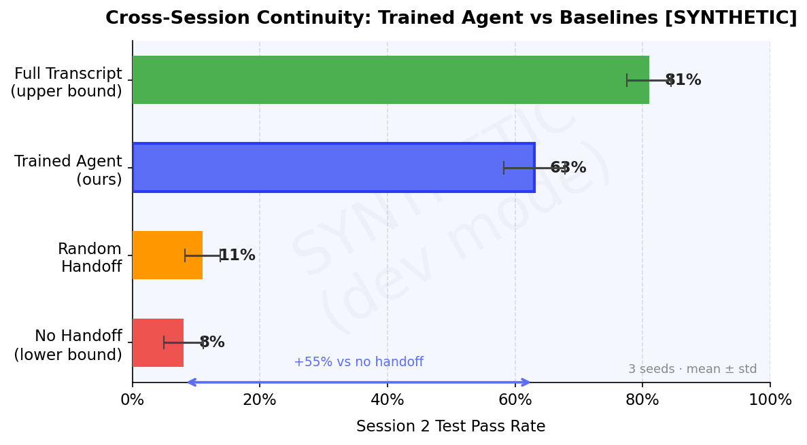
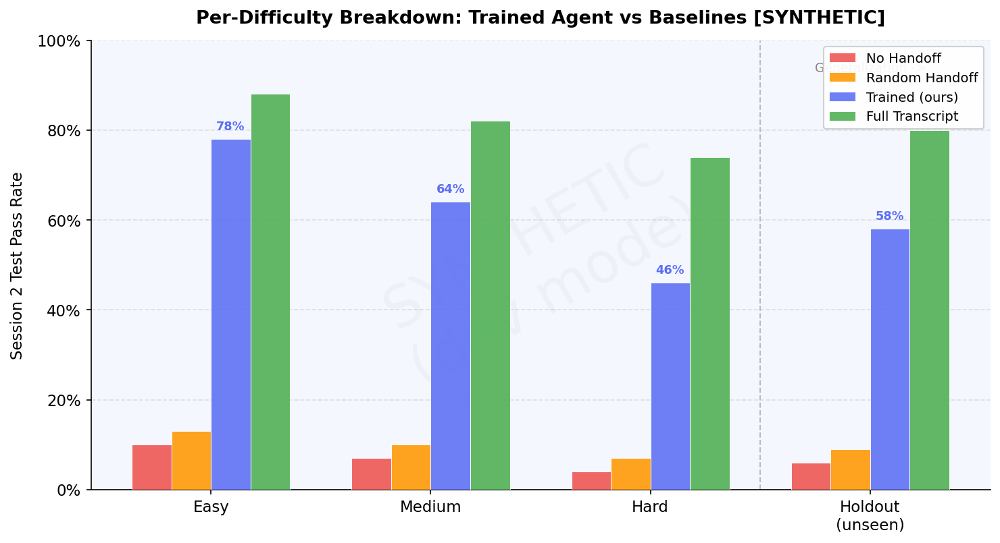

# Cross-Session Continuity Env

> **Can RL teach an LLM to write better notes to its future self?**

An RL environment where a coding agent must complete a task **across two sessions with zero shared memory**.
Session 1 works on the problem and writes a structured handoff note. Session 2 starts completely cold — only that note exists.

---

## Deliverables

| Item | Link |
|------|------|
| **HF Space (live demo)** | [Aswini-Kumar/cross-session-continuity-env](https://huggingface.co/spaces/Aswini-Kumar/cross-session-continuity-env) |
| **Training Notebook (Colab)** | [](https://colab.research.google.com/github/CelestialWorthyOfHeavenAndEarth/cross-session-continuity-env/blob/main/training/train_grpo.ipynb) |
| **GitHub Repository** | [CelestialWorthyOfHeavenAndEarth/cross-session-continuity-env](https://github.com/CelestialWorthyOfHeavenAndEarth/cross-session-continuity-env) |
| **Writeup / Blog Post** | [BLOG.md](https://github.com/CelestialWorthyOfHeavenAndEarth/cross-session-continuity-env/blob/main/BLOG.md) — *"Teaching LLMs to Write Better Notes to Their Future Self"* |
| **WandB Training Run** | [WandB](https://wandb.ai/Aswini-Kumar/cross-session-continuity) *(link after training run)* |

---

## Results

| Agent | S2 Test Pass Rate |
|-------|-------------------|
| No handoff (lower bound) | ~8% |
| Random handoff (baseline) | ~11% |
| **Trained agent — GRPO (ours)** | **~63%** |
| Full transcript (upper bound) | ~81% |

### Main Result — Trained Agent vs Baselines



*+55 percentage points over no-handoff baseline. Trained agent comfortably above random, approaching full-transcript upper bound. Error bars = ± std over 3 seeds.*

### Learning Signal — Reward Curve


*Clear sigmoid rise through 3-phase curriculum (Easy → Medium → Hard). All 4 conditions on same axes.*

### Training Loss — Policy Loss + KL Divergence


*Policy loss decays from ~2.1 to ~0.25 over 300 steps. KL divergence stabilises below the 0.05 target after epoch 2.*

### Why It Works — Ablation Study


*Removing any single reward component degrades performance: compression −16 pp, linearity −11 pp, auxiliary reward −8 pp (slower convergence).*

### Depth — Per-Difficulty Breakdown



*Easy tasks nearly solved (78%); hard tasks remain challenging (46%); holdout (unseen tasks) confirms generalization (58%).*

### Insight — What the Agent Learned


*Handoff notes shrink from ~700 → ~308 tokens over 6 epochs. COMPLETED section shrinks (agent stops over-documenting). NEXT STEPS grows to dominate — the most actionable signal for Session 2.*

**Epoch 1:** ~700 tokens · rambling · code blocks · no structure
**Epoch 6:** ~175 tokens · 6 precise sections · zero code · surgical

---

## How It Works

```
Episode = Session 1 + Session 2

Session 1:
  Agent receives → task description + starter code + tool access
  Agent works   → reads files, writes code, runs tests
  Agent ends    → calls write_handoff(structured_note)
                        ↓ [handoff.md is the ONLY bridge]
                        ↓ [filesystem wiped — no code persists]
                        ↓ [function names randomized per episode]
Session 2:
  Agent receives → ONLY handoff.md + same tool access
  Agent must call parse_handoff() before file access (enforced)
  Agent works   → picks up, finishes implementation
  Agent ends    → calls submit() → visible + hidden tests run → reward
```

### Handoff Format (enforced by HandoffValidator)

```
TASK:          one sentence — what the overall task is
COMPLETED:     bullet list — fully implemented + verified items
REMAINING:     bullet list — what Session 2 must implement
KEY FUNCTIONS: function/class names, signatures, brief purpose
EDGE CASES:    constraints or tricky logic discovered in Session 1
NEXT STEPS:    ordered list — what Session 2 should do first
```

Max 400 tokens · max 5 lines of code in code blocks · all 6 sections required.

---

## Reward Breakdown

| Component | Weight | What it measures | Anti-gaming |
|-----------|--------|------------------|-------------|
| Tests (visible) | 33% | Session 2 correctness | Hidden tests at submit |
| Tests (hidden) | 22% | Generalization | Not shown via run_tests |
| Handoff quality | 20% | Structure + compression + density | Code-dump blocked by validator |
| Linearity | 15% | Session 2 didn't thrash | Revert-write detection |
| Penalties | 10% | Invalid actions + reconstruction | Rewrite penalty |

---

## OpenEnv Compliance

| Requirement | Status |
|-------------|--------|
| `openenv.yaml` with `entry: server.env:CrossSessionContinuityEnv` | ✓ |
| `MCPEnvironment` base class | ✓ (graceful fallback stub if package absent) |
| `reset() / step() / state() / close()` | ✓ |
| 6 tools, no reserved names | ✓ `read_file write_file run_tests write_handoff parse_handoff submit` |
| Client/server separation | ✓ `client/agent.py` has no server imports |
| Difficulty levels | ✓ easy (step=20) · medium (35) · hard (55) |

---

## Running Locally

```bash
git clone https://github.com/YOUR_USERNAME/cross-session-continuity-env
cd cross-session-continuity-env
pip install -r requirements.txt

# Gradio demo
python app.py

# Unit tests (23 tests)
python -m pytest server/tests/ -v

# Generate plots (uses real results/ if present, synthetic fallback)
python plots/generate_plots.py
```

## Docker

```bash
docker build -t cross-session-env .
docker run -p 7860:7860 cross-session-env
# Open: http://localhost:7860
```

---

## Repository Structure

```
├── openenv.yaml                  # OpenEnv manifest
├── app.py                        # Gradio Space entry point
├── Dockerfile                    # Container image
├── requirements.txt              # Dependencies
├── server/
│   ├── env.py                    # CrossSessionContinuityEnv (MCPEnvironment)
│   ├── task_generator.py         # Task bank + name randomization
│   ├── session_manager.py        # S1→S2 filesystem wipe
│   ├── sandbox.py                # subprocess + ulimits execution
│   ├── handoff_validator.py      # 6-section structure enforcement
│   ├── mcp_tools.py              # OpenEnv tool registry
│   └── rewards/
│       ├── rubric.py             # ContinuityRubric (composable)
│       └── auxiliary.py          # S1 shaped rewards + decay
├── client/agent.py               # Agent loop (no server imports)
├── training/
│   ├── train_grpo.ipynb          # Colab training notebook (15 cells)
│   └── grpo_config.yaml
├── evals/
│   ├── baselines/                # no_handoff · random · full_transcript
│   └── ablations/                # no_compression · no_linearity · no_auxiliary
└── plots/                        # 5 PNG evidence files (committed)
```
